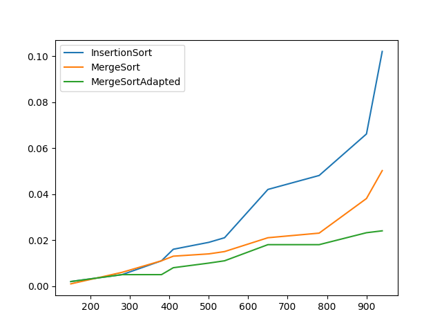

# Descrição
Projeto 01 da disciplina Projeto e Análise de Algoritmos do curso de Pós Graduação IFCE.

Este projeto tem como objetivo comparar os tempos de execução entre os algoritmos Insertion Sort 
e Merge Sort Adaptado, de modo que este utiliza o Insertion Sort para entradas pequenas.


# Equipe
- ## Daniel Fiuza Cordeiro de Moraes

# Estrutura do Projeto
O projeto foi desenvolvido utilizando POO com o objetivo de reutilizá-lo e garantir uma boa legibilidade. Para isso, foi gerada a seguinte estrutura:
```bash
.
├── src                     # Classes do Projeto
│   ├── InsertionSort       # Classe que define o algoritmo InsertionSort
│   ├── MergeSort           # Classe que define o algoritmo MergeSort
│   ├── MergeSortAdapted    # Classe que define o algoritmo MergeSortAdapted
│   ├── Utils               # Classe que define métodos relacionados ao manuseio de arrays 
│   └── Plot                # Classe que define métodos para plotagem de gráficos
├── main                    # Arquivo principal que contém a lógica e o fluxo do código
└── README.md
```

# Execução
O projeto possui como dependência o programa python instalado.

Para executar o código, entre na raiz do projeto e execute os comandos a seguir:
```bash
# Instala o ambiente virtual
python -m venv venv
# Ativa o ambiente virtual
source venv/bin/activate
# Instala dependências
pip install -r requirements.txt
# Executa o código
python main.py
```

# Resultados Esperados

